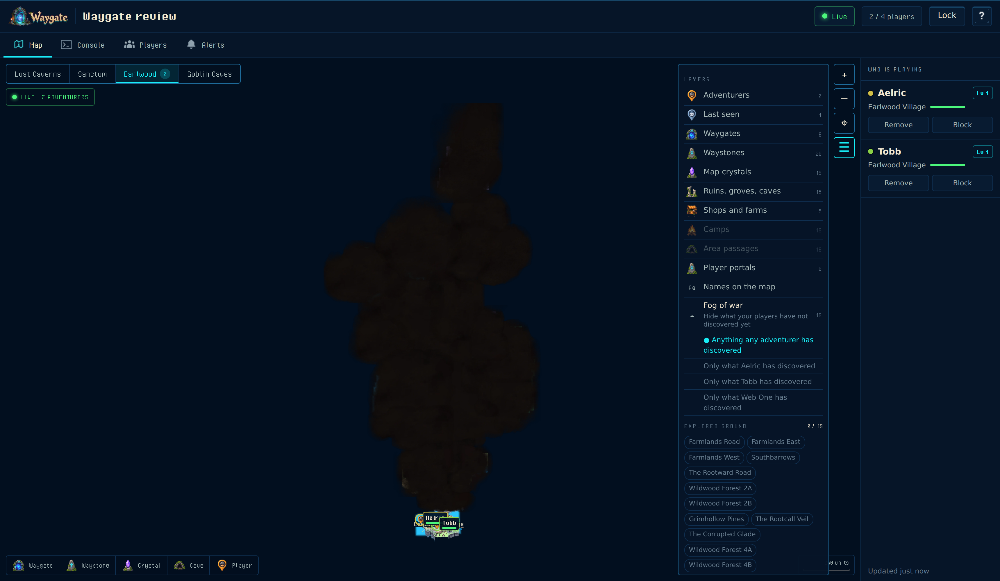
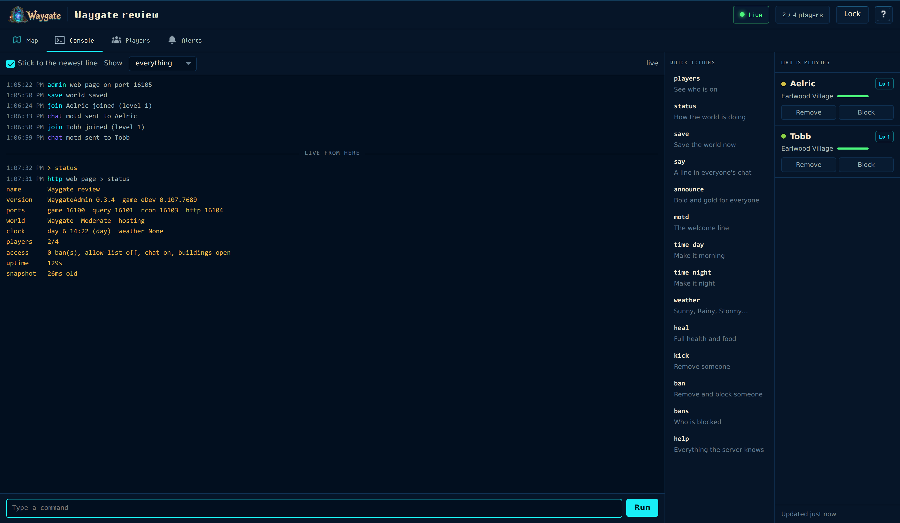

<p align="center">
  
</p>

<p align="center">
  <a href="#requirements"></a>
  <a href="https://store.steampowered.com/app/2402680/"></a>
  <a href="https://github.com/HumanGenome/Waygate"></a>
  <a href="LICENSE"></a>
</p>

# WaygateServer

[Dimraeth](https://store.steampowered.com/app/2402680/) has no dedicated server. WaygateServer runs the game as one on a Windows machine, and players join it by IP and port through the [Waygate app](https://github.com/HumanGenome/Waygate). This repo is for the person running the server.

## What it does

- Runs Dimraeth with no screen, no desktop session and no Steam login
- Creates and saves the world on the host
- Takes direct connections on a UDP port
- No character of its own: nothing is spawned for the server, so it takes no seat, leads no party and is in no list
- Serves its own web page: the world map drawn from the game's own pixels, every player's position every five seconds, a fog of war over ground nobody has found yet, the console, who is playing, Discord alerts
- Loads server mods from a folder and tells the Waygate app which client mods a server needs, so players get them on connect
- Source RCON and a signed HTTP API for admin tools, once an admin password is set
- Bans and an allow list keyed on the player's character and address, kept across restarts
- Answers Source server query on the port above the gameplay port
- Optional join password
- Up to 8 players, the game's own limit

## What it does not do

- **It does not ship Dimraeth.** You install the game files yourself; the server runs them from a folder you choose.
- **It does not replace the player's game.** Everyone joining still runs retail Dimraeth, with the Waygate app on top.
- **It is not an anti-cheat.** Waygate does not police what connected clients do.

## Requirements

| | |
|---|---|
| OS | Windows 10, Windows 11, or Windows Server |
| Game files | A Dimraeth installation on the host (about 6 GB) |
| Ports | Two UDP ports, the gameplay port and the one above it for server query; three TCP ports above those for RCON, the admin API and the web page, opened only for the people who should reach them |
| Hardware | No GPU required; plan on 4 to 8 GB of RAM per server (the game simulates the whole world even with nobody online) |

## Ports

| Port | Protocol | Used for |
|---|---|---|
| base (default `15569`) | UDP | Gameplay, the port players connect to |
| base + 1 (default `15570`) | UDP | Server query (Source A2S) |
| base + 3 (default `15572`) | TCP | Source RCON, once an admin password is set |
| base + 4 (default `15573`) | TCP | The admin API the Waygate app's Console tab uses, once an admin password is set |
| base + 5 (default `15574`) | TCP | The server's own web page: live map, console, players, alerts ([docs/web.md](docs/web.md)) |

The two UDP ports must be open on the host firewall and forwarded if the server sits behind NAT. Open the TCP ports only for the people who should reach them. A listener whose usual port is taken by another program moves to a spare port inside the same block of ten and says so ([docs/status-and-commands.md](docs/status-and-commands.md#when-a-port-is-taken)).

## Setup

1. Put a copy of Dimraeth's game files on the host (install it through Steam on any PC and copy the game folder, or use SteamCMD with an account that owns the game).
2. Download `WaygateServer-<version>.zip` from the [latest release](https://github.com/HumanGenome/WaygateServer/releases/latest) and unzip it **over** the game folder, so `winhttp.dll` and `BepInEx\` sit beside `Dimraeth.exe`.
3. Edit `BepInEx\config\com.humangenome.waygate.host.cfg`: set the gameplay port, the server name, the world name and difficulty, and a join password if you want one.
4. Start the server from the game folder:

   ```
   Dimraeth.exe -batchmode -nographics
   ```

   The world is created on the first start. `waygate\boot-report.txt` says `HOSTING` once players can join, or exactly what stopped it if they cannot.
5. Hand players the address as `ip:port`. They add it in the Waygate app and press Connect.

Running two servers on one machine: give each its own copy of the game folder (a junction works) and its own port, and pass `--waygate-dir=<folder>` so their saves and status files never share a path.

## The web page

Open `http://<server ip>:<game port + 5>/` in a browser. The server serves the page itself; nothing else is installed and it works with no internet.

<p align="center">
  
</p>

- **Map**: the world from the game's own pixels, one tab per area, sharp all the way in to the game's closest zoom. Every connected player's position and name, refreshed every five seconds; the Waygates and map crystals they have found; boss fights, portals and the Sanctum's buildings. The layers menu picks what is drawn, and its fog of war hides every region no player has discovered yet, the game's own fog, either for anyone's discoveries or one player's.
- **Console**: the server's live log and a command line, with the common commands one click away.
- **Players**: everyone connected, with level, area and time on; remove or block a player.
- **Alerts**: Discord messages the server posts itself for joins and leaves, deaths, a full server, the world coming up and a scheduled stop.

<p align="center">
  
</p>

<p align="center">
  
</p>

Anyone with the address sees the map and who is playing. The console, the player controls and the alerts unlock with the admin password (`Password` under `[Admin]` in `BepInEx\config\com.humangenome.waygate.admin.cfg`), the same one RCON and the Waygate app's Console tab use; it stays in the browser it was typed in and signs each action instead of being sent. `PublicMap = false` under `[Web]` puts the map behind the password too; `Enable = false` switches the page off. The page cannot say the server is down: a message the server sends cannot arrive once the server is gone. Settings, sharing and what it cannot do: [docs/web.md](docs/web.md).

## Running it from a panel or a script

`waygate\status.json` is rewritten every 5 seconds with the verdict, ports, player count, roster and uptime. Drop a `waygate\commands.txt` with `save`, `shutdown`, `restart` or `kick <name>` and the host runs it on its next tick. Details: [docs/status-and-commands.md](docs/status-and-commands.md).

## Managed hosting

If you would rather not run the machine, [SurvivalServers.com](https://www.survivalservers.com/services/game_servers/dimraeth/?utm_source=github&utm_medium=readme_install&utm_campaign=waygate) runs Dimraeth servers with Waygate already installed and the ports already open.

## Changelog

Every released version is listed in [CHANGELOG.md](CHANGELOG.md), split by what changed on the **Server** and what changed on the **Client**. Release pages quote the matching section verbatim.

## Contributing

See [CONTRIBUTING.md](CONTRIBUTING.md). Security issues go through [private reporting](.github/SECURITY.md), never a public issue.

## Community note

Waygate is an independent community project. It is not affiliated with, endorsed by, or supported by Mudtek.

## License

MIT, see [LICENSE](LICENSE).
