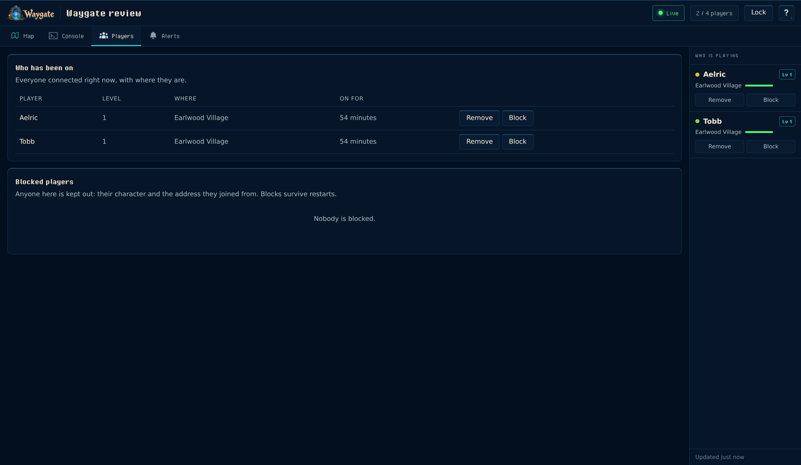
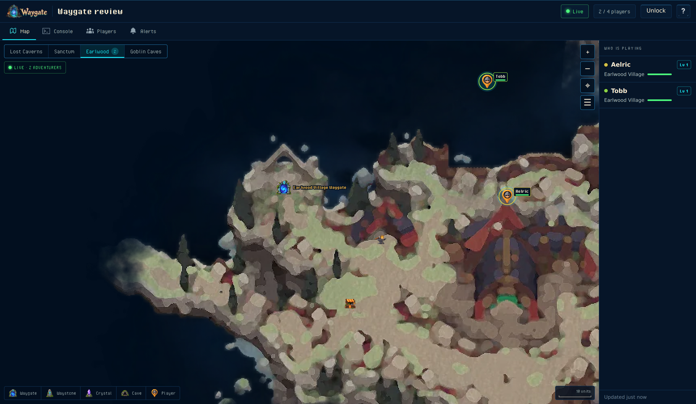

# The server's web page

Every Waygate server serves a page about itself on **game port + 5** (`15574` for a server on the default `15569`). It runs inside the host process and needs nothing installed: open `http://<server ip>:<game port + 5>/` in a browser.

<p align="center">
  
</p>

## What is on it

| Tab | Who sees it | What it shows |
|---|---|---|
| Map | anyone with the address | The world as the game draws it, one tab per area (Earlwood, Lost Caverns, Sanctum, Goblin Caves), with every connected player's live position and name, the Waygates and map crystals they have found, boss fights, temporary portals and the Sanctum's buildings. The layers button can veil ground nobody has explored yet. |
| Console | the owner | The server's live log (joins, leaves, chat, deaths, saves, admin actions, the game's own warnings) and a command line. The quick actions run the common commands; `help` lists them all. |
| Players | anyone; controls for the owner | Everyone connected, with level, area and time on. The owner can remove or block a player and manage the block list. |
| Alerts | the owner | Discord messages the server posts itself: joins and leaves, deaths, the server filling up, the world coming up, a scheduled stop, and an optional round-up. |

The rail on the right lists who is playing on every tab; on a phone it is a sheet at the bottom.

<p align="center">
  
</p>

<p align="center">
  
</p>

## The map, close up

The map is the world as the game itself draws it: a capture of the loaded world through the game's own renderer, cut into tiles. The package carries it at up to 8 pixels per world unit. Zooming in stops at 16 screen pixels per unit, the game's own closest zoom, where those pixels are doubled cleanly; a picture at exactly its own size is drawn pixel for pixel, and zooming out uses pre-scaled copies, so nothing is stretched or blurred at any level. The layers button hides and shows each kind of marker, and holds the fog of war: the game's own dark, soft-edged cover over every region no player has discovered yet, with the markers and names on that ground withheld. It is off unless `FogOfWar = world` is set; the unlocked owner can switch it either way from the layers menu.

<p align="center">
  
</p>

## The password

The owner's parts unlock with the admin password: `Password` under `[Admin]` in `BepInEx\config\com.humangenome.waygate.admin.cfg`. It is the same password RCON and the Waygate app's Console tab use. Typed once, it stays in that browser (nowhere else) and signs every owner action the same way the app does; it is never sent as text. With no password set, the map and the player list still work and the owner parts say so.

## Sharing the address

Anyone who can reach the port sees the map, with player names and positions. To keep the map for the owner too, set `PublicMap = false` under `[Web]`; the page then asks for the password before drawing it. To switch the page off entirely, set `Enable = false` under `[Web]`.

Behind NAT, forward TCP `game port + 5` like the two UDP ports. The page is plain HTTP; put it behind your own reverse proxy if you want a name and a certificate.

## Settings

`BepInEx\config\com.humangenome.waygate.admin.cfg`:

```ini
[Web]
Enable = true        # serve the page
Port = 0             # 0 = game port + 5
PublicMap = true     # false = the map needs the password too
FogOfWar = off       # world = ground no player has discovered yet is hidden under the game's own fog
WebRoot =            # optional folder overriding the page files, for editing the page

[Alerts]
DiscordWebhook =     # set from the Alerts tab or here
OnJoinLeave = true
OnDeath = true
OnFull = true
OnStartStop = true
RoundupHours = 0     # 0 = never
```

## Where the pictures come from

The map is drawn by the game: the loaded world rendered through the game's own camera at noon, with monsters, weather and screen effects off, placed by the area rectangles the running game reports, tiled for the browser and shipped in the release beside the plugin (`BepInEx\plugins\WaygateAdmin\www\maps`). Live positions come from the host's own memory every five seconds while a page is open, and nothing is written to disk for it.

## What it is not

The page cannot tell you the server is down: a message the server sends cannot arrive once the server is gone. It is not an anti-cheat and it does not edit the world. Start, stop and restart are `shutdown` and `restart` in the console, with a countdown players see in chat.
